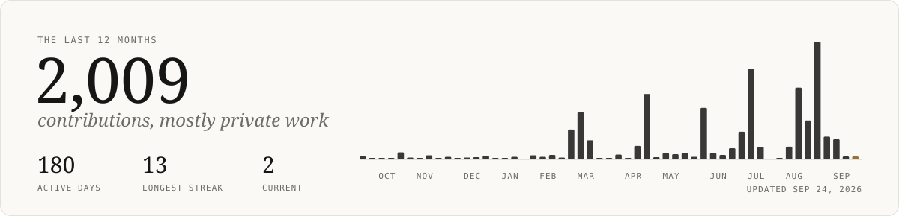

<picture>
  <source media="(prefers-color-scheme: dark)" srcset="assets/header-dark.svg">
  
</picture>

  <samp>
    <a href="https://github.com/RuslanAMandell/UnslopMyCode">unslop</a> .
    <a href="https://github.com/RuslanAMandell/glasslist-app/releases/latest">glasslist</a> .
    <a href="https://linkedin.com/in/ruslanmandell">linkedin</a> .
    <a href="mailto:ruslanmandell@outlook.com">email</a>
  </samp>

 

Hey, I'm Ruslan, a software engineer in Toronto.

**Things I've done**
- Software engineer at [Cybrid](https://cybrid.xyz)
- Grew a collectibles store from $0 to $300K in its first year
- Four years of freelance web and payments work for small businesses
- Built a macOS app, a Claude Code plugin, and a few Roblox games

**Things I like**
- Building small tools for the way I actually work, like a study app that helps me go deep on the topics I want to know well
- Game dev, my guilty pleasure and where I lose track of time
- Walking, a lot. My friends and family think the distances are insane
- BJJ, and time with family, friends and my girlfriend
- Simple ideas that make you think "how didn't I think of that"

**Favorite project so far**
The Africa integration at Cybrid, my first big project after going full-time. I had to learn payment flows, logistics and regulations, with a mentor who's the most helpful senior engineer I've worked with. Then I got to watch millions of dollars move through code I wrote.

**On AI**
Agentic coding works with you, not for you. It should speed up good work, not multiply slop.

**Someday**
I love code, but I'm an artist at heart. A coffee shop or a clothing brand is on the list. I just like making things for people.

Studying CS at TMU, done January 2027.

<!-- latest starts -->
<samp>LATEST</samp> &nbsp; released <a href="https://github.com/RuslanAMandell/UnslopMyCode/releases/tag/v0.2.1">UnslopMyCode v0.2.1</a> Aug 20
<!-- latest ends -->

 

### Side projects

- **LeadNest**: lead-generation SaaS with Google Places targeting, automated outreach and Stripe credit billing
- **Quizzler.io**: turns uploaded images into quizzes with OpenAI and Google Cloud Vision

 

<picture>
  <source media="(prefers-color-scheme: dark)" srcset="assets/activity-dark.svg">
  
</picture>

Header and graph are generated by <a href="scripts/build.mjs">a script</a> that runs daily and follows your light or dark theme.

