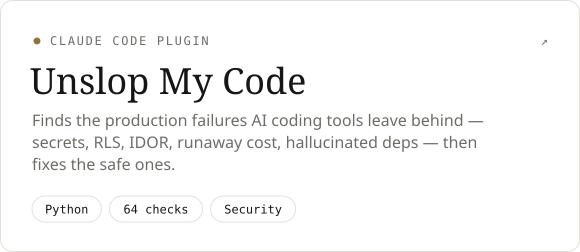
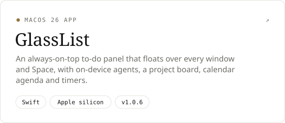
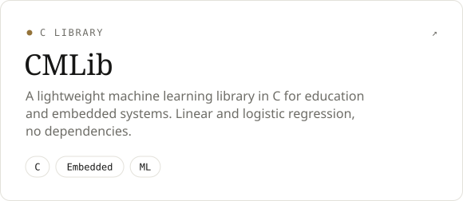
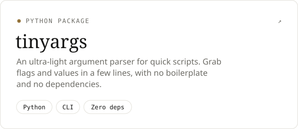

<picture>
  <source media="(prefers-color-scheme: dark)" srcset="assets/header-dark.svg">
  
</picture>

<br>

I'm an engineer and founder who takes products from idea to shipped, solo when needed: AI developer tools, native macOS apps, games, SaaS and ecommerce.

Along the way I've been the sole engineer on a white-label B2B payments app at **[Cybrid](https://cybrid.xyz)**, where I shipped the integrations that opened cross-border remittance corridors into Africa and India, and grew a collectibles brand from $0 to $300K in its first year. Lately I'm most interested in **agentic commerce**: making software and stores legible to the AI agents that are starting to use them. I finish my CS degree at Toronto Metropolitan University in January 2027.

<br>

### Selected work

<p>
  <a href="https://github.com/RuslanAMandell/UnslopMyCode"><picture><source media="(prefers-color-scheme: dark)" srcset="assets/card-unslopmycode-dark.svg"></picture></a>
  <a href="https://github.com/RuslanAMandell/glasslist-app"><picture><source media="(prefers-color-scheme: dark)" srcset="assets/card-glasslist-app-dark.svg"></picture></a>
</p>
<p>
  <a href="https://github.com/RuslanAMandell/CMLib"><picture><source media="(prefers-color-scheme: dark)" srcset="assets/card-cmlib-dark.svg"></picture></a>
  <a href="https://github.com/RuslanAMandell/tinyargs"><picture><source media="(prefers-color-scheme: dark)" srcset="assets/card-tinyargs-dark.svg"></picture></a>
</p>

<details>
<summary><b>Earlier ventures</b></summary>
<br>

| | |
|:--|:--|
| **PokePortal** | Collectibles ecommerce brand. $0 → $300K USD in year one, run solo end to end: sourcing, live commerce, fulfillment. |
| **LeadNest** | Lead-generation SaaS. Business targeting via Google Places, automated outreach, Stripe credit-based billing. |
| **Quizzler.io** | AI quiz generator that turns uploaded images into quizzes (OpenAI + Google Cloud Vision). |
| **Freelance** | Four years of ecommerce, booking and Stripe payment builds for small businesses, many kept on monthly retainers. |

</details>

<br>

### Activity

<picture>
  <source media="(prefers-color-scheme: dark)" srcset="assets/activity-dark.svg">
  
</picture>

<br><br>

### Toolkit

```
languages   TypeScript · Python · Swift · Ruby · Luau · C / C++ · Java
product     React · Next.js · Tailwind · SwiftUI · Rails · Node · Postgres
systems     Temporal · Stripe · payment-gateway integrations · AWS · GCP
workflow    Claude Code with custom agent skills & plugins · Codex · Cursor
```

<br>

### Contact

Building something ambitious in AI, commerce, or developer tooling? I'd like to hear about it.

[LinkedIn](https://linkedin.com/in/ruslanmandell) &nbsp;·&nbsp; [Email](mailto:ruslanmandell@outlook.com)

<sub>This page rebuilds itself daily. Header, cards and activity graph are generated SVGs (<a href="scripts/build.mjs">source</a>) that follow your light or dark theme.</sub>
